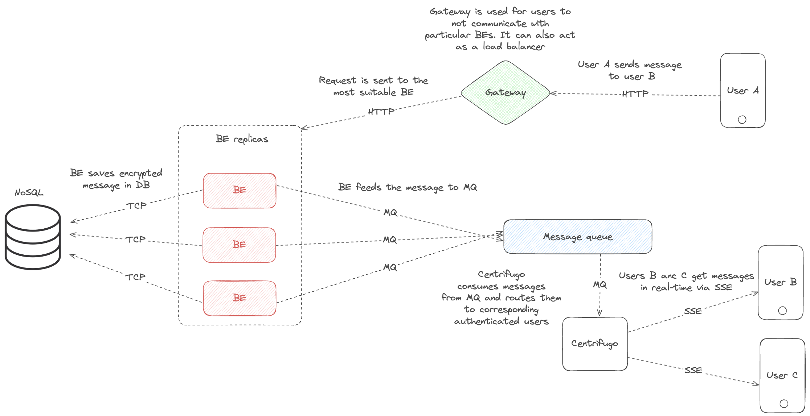

# Infrastructure

The architecture of the asynchronous verifiable group management system consists of the following components: Node, MessageRelay, Transistor(+PostgreSQL), NATS JetStream, Centrifugo, and MongoDB.

The system comprises two core components:

- **Node:** A server-side component that **brokers** messages, **stores** encrypted data, and **manages** chat state.
- **Client:** A user-side component that **handles** message encryption, exchange, and key synchronization.

The high level of the system architecture:

## Storage
MongoDB was chosen for data storage because there is no need for relationships between data and high throughput is required. MongoDB can be replaced with any other KV NoSQL database.

## Reactivity
To make the system reactive, Centrifugo was added — a service that provides SSE channels. Each channel is responsible for a separate group and sends real-time updates about the group. For ease of use, the NATS JetStream message broker was added to Centrifugo, which integrates with Centrifugo. Another component of reactivity is the MessageRelay service, which connects to the MongoDB replica set, listens for new frame insertion events, and sends new frames to the appropriate topic in NATS JetStream.

## Node
Node is a delivery service that performs proof verification and stores the frame history. Node does not know the identity of any group members except the owner and cannot read group messages.

## Transistor
The Transistor service is a service used as a file sharing service, for example, to share your identity or a large piece of information that cannot be sent in a frame. Data/files are deleted after the first read.

## Client
The client side is implemented by the consumer. For this, there is the crate zrt-client-sdk.

## Local development
For local development and testing, it is convenient to use the [infrastructure](https://github.com/zero-art-rs/infrastructure) repository, which allows you to raise the entire system locally with a single command.
